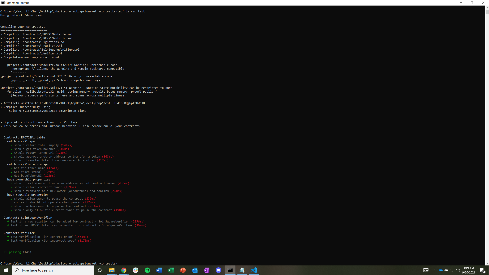
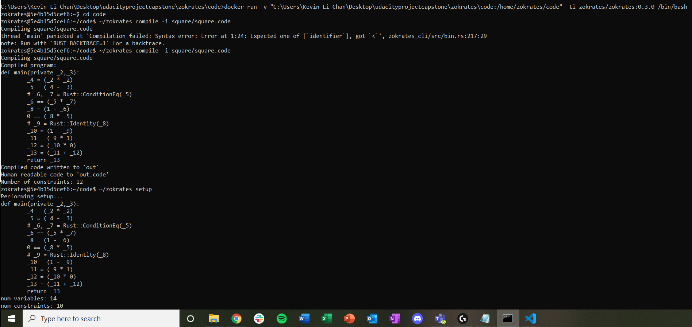
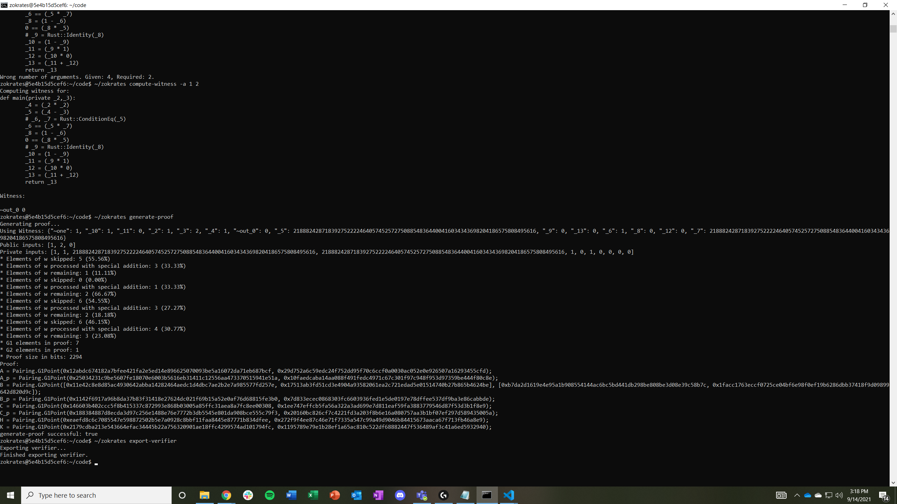

# Udacity Blockchain Capstone

The capstone will build upon the knowledge gained in the course in order to build a decentralized housing product.

# Installing & Testing

## Environment Details

node v14.17.3

npm v6.14.13

truffle v5.4.8

## Installing Packages

`npm install`

## Running truffle tests

In the command prompt terminal run:
`ganache-cli`

In a separate command prompt terminal run:
`cd eth-contracts`
`truffle.cmd test`

All 19 tests should pass:

# Deployed ERC721 Contract on Rinkeby

## Verifier Contract:
transaction hash: `0xa165b02a0d804342c265b5a9acf686b30b13053fdd68ff69bbddfd54601fbaee`

contract address: `0xDe3946a6db6F6aa77BFF34baCa18618724215961`

account: `0x6C9D9620f3723E814B96f91d1A16B5348a103F75`

contract abi: `[
    {
      "anonymous": false,
      "inputs": [
        {
          "indexed": false,
          "internalType": "string",
          "name": "s",
          "type": "string"
        }
      ],
      "name": "Verified",
      "type": "event"
    },
    {
      "constant": false,
      "inputs": [
        {
          "internalType": "uint256[2]",
          "name": "a",
          "type": "uint256[2]"
        },
        {
          "internalType": "uint256[2]",
          "name": "a_p",
          "type": "uint256[2]"
        },
        {
          "internalType": "uint256[2][2]",
          "name": "b",
          "type": "uint256[2][2]"
        },
        {
          "internalType": "uint256[2]",
          "name": "b_p",
          "type": "uint256[2]"
        },
        {
          "internalType": "uint256[2]",
          "name": "c",
          "type": "uint256[2]"
        },
        {
          "internalType": "uint256[2]",
          "name": "c_p",
          "type": "uint256[2]"
        },
        {
          "internalType": "uint256[2]",
          "name": "h",
          "type": "uint256[2]"
        },
        {
          "internalType": "uint256[2]",
          "name": "k",
          "type": "uint256[2]"
        },
        {
          "internalType": "uint256[2]",
          "name": "input",
          "type": "uint256[2]"
        }
      ],
      "name": "verifyTx",
      "outputs": [
        {
          "internalType": "bool",
          "name": "r",
          "type": "bool"
        }
      ],
      "payable": false,
      "stateMutability": "nonpayable",
      "type": "function"
    }
  ]`

## SolnSquareVerifier Contract:
transaction hash: `0xb1b5da406805d48051a3f36a478f4f8e2c3b4c9301c04e604e7dd032b413ea98`

contract address: `0xA1d5cC54146F97Bf1817A958c2fA0eD49682B6EC`

account: `0x6C9D9620f3723E814B96f91d1A16B5348a103F75`

contract abi: `[
    {
      "inputs": [
        {
          "internalType": "address",
          "name": "veriContract",
          "type": "address"
        },
        {
          "internalType": "string",
          "name": "name",
          "type": "string"
        },
        {
          "internalType": "string",
          "name": "symbol",
          "type": "string"
        }
      ],
      "payable": false,
      "stateMutability": "nonpayable",
      "type": "constructor"
    },
    {
      "anonymous": false,
      "inputs": [
        {
          "indexed": true,
          "internalType": "address",
          "name": "owner",
          "type": "address"
        },
        {
          "indexed": true,
          "internalType": "address",
          "name": "approved",
          "type": "address"
        },
        {
          "indexed": true,
          "internalType": "uint256",
          "name": "tokenId",
          "type": "uint256"
        }
      ],
      "name": "Approval",
      "type": "event"
    },
    {
      "anonymous": false,
      "inputs": [
        {
          "indexed": true,
          "internalType": "address",
          "name": "owner",
          "type": "address"
        },
        {
          "indexed": true,
          "internalType": "address",
          "name": "operator",
          "type": "address"
        },
        {
          "indexed": false,
          "internalType": "bool",
          "name": "approved",
          "type": "bool"
        }
      ],
      "name": "ApprovalForAll",
      "type": "event"
    },
    {
      "anonymous": false,
      "inputs": [
        {
          "indexed": true,
          "internalType": "address",
          "name": "newOwner",
          "type": "address"
        }
      ],
      "name": "OwnerTransferred",
      "type": "event"
    },
    {
      "anonymous": false,
      "inputs": [
        {
          "indexed": true,
          "internalType": "address",
          "name": "account",
          "type": "address"
        }
      ],
      "name": "Paused",
      "type": "event"
    },
    {
      "anonymous": false,
      "inputs": [
        {
          "indexed": false,
          "internalType": "uint256",
          "name": "solIndex",
          "type": "uint256"
        },
        {
          "indexed": true,
          "internalType": "address",
          "name": "solAddress",
          "type": "address"
        }
      ],
      "name": "SolutionAdded",
      "type": "event"
    },
    {
      "anonymous": false,
      "inputs": [
        {
          "indexed": true,
          "internalType": "address",
          "name": "from",
          "type": "address"
        },
        {
          "indexed": true,
          "internalType": "address",
          "name": "to",
          "type": "address"
        },
        {
          "indexed": true,
          "internalType": "uint256",
          "name": "tokenId",
          "type": "uint256"
        }
      ],
      "name": "Transfer",
      "type": "event"
    },
    {
      "anonymous": false,
      "inputs": [
        {
          "indexed": true,
          "internalType": "address",
          "name": "account",
          "type": "address"
        }
      ],
      "name": "Unpaused",
      "type": "event"
    },
    {
      "constant": false,
      "inputs": [
        {
          "internalType": "bytes32",
          "name": "_myid",
          "type": "bytes32"
        },
        {
          "internalType": "string",
          "name": "_result",
          "type": "string"
        }
      ],
      "name": "__callback",
      "outputs": [],
      "payable": false,
      "stateMutability": "nonpayable",
      "type": "function"
    },
    {
      "constant": false,
      "inputs": [
        {
          "internalType": "bytes32",
          "name": "_myid",
          "type": "bytes32"
        },
        {
          "internalType": "string",
          "name": "_result",
          "type": "string"
        },
        {
          "internalType": "bytes",
          "name": "_proof",
          "type": "bytes"
        }
      ],
      "name": "__callback",
      "outputs": [],
      "payable": false,
      "stateMutability": "nonpayable",
      "type": "function"
    },
    {
      "constant": false,
      "inputs": [
        {
          "internalType": "address",
          "name": "to",
          "type": "address"
        },
        {
          "internalType": "uint256",
          "name": "tokenId",
          "type": "uint256"
        }
      ],
      "name": "approve",
      "outputs": [],
      "payable": false,
      "stateMutability": "nonpayable",
      "type": "function"
    },
    {
      "constant": true,
      "inputs": [
        {
          "internalType": "address",
          "name": "owner",
          "type": "address"
        }
      ],
      "name": "balanceOf",
      "outputs": [
        {
          "internalType": "uint256",
          "name": "",
          "type": "uint256"
        }
      ],
      "payable": false,
      "stateMutability": "view",
      "type": "function"
    },
    {
      "constant": true,
      "inputs": [
        {
          "internalType": "uint256",
          "name": "tokenId",
          "type": "uint256"
        }
      ],
      "name": "getApproved",
      "outputs": [
        {
          "internalType": "address",
          "name": "",
          "type": "address"
        }
      ],
      "payable": false,
      "stateMutability": "view",
      "type": "function"
    },
    {
      "constant": true,
      "inputs": [],
      "name": "getBaseTokenURI",
      "outputs": [
        {
          "internalType": "string",
          "name": "",
          "type": "string"
        }
      ],
      "payable": false,
      "stateMutability": "view",
      "type": "function"
    },
    {
      "constant": true,
      "inputs": [],
      "name": "getName",
      "outputs": [
        {
          "internalType": "string",
          "name": "",
          "type": "string"
        }
      ],
      "payable": false,
      "stateMutability": "view",
      "type": "function"
    },
    {
      "constant": true,
      "inputs": [],
      "name": "getOwner",
      "outputs": [
        {
          "internalType": "address",
          "name": "",
          "type": "address"
        }
      ],
      "payable": false,
      "stateMutability": "view",
      "type": "function"
    },
    {
      "constant": true,
      "inputs": [],
      "name": "getSymbol",
      "outputs": [
        {
          "internalType": "string",
          "name": "",
          "type": "string"
        }
      ],
      "payable": false,
      "stateMutability": "view",
      "type": "function"
    },
    {
      "constant": true,
      "inputs": [
        {
          "internalType": "address",
          "name": "owner",
          "type": "address"
        },
        {
          "internalType": "address",
          "name": "operator",
          "type": "address"
        }
      ],
      "name": "isApprovedForAll",
      "outputs": [
        {
          "internalType": "bool",
          "name": "",
          "type": "bool"
        }
      ],
      "payable": false,
      "stateMutability": "view",
      "type": "function"
    },
    {
      "constant": false,
      "inputs": [
        {
          "internalType": "address",
          "name": "to",
          "type": "address"
        },
        {
          "internalType": "uint256",
          "name": "tokenId",
          "type": "uint256"
        }
      ],
      "name": "mint",
      "outputs": [
        {
          "internalType": "bool",
          "name": "",
          "type": "bool"
        }
      ],
      "payable": false,
      "stateMutability": "nonpayable",
      "type": "function"
    },
    {
      "constant": true,
      "inputs": [
        {
          "internalType": "uint256",
          "name": "tokenId",
          "type": "uint256"
        }
      ],
      "name": "ownerOf",
      "outputs": [
        {
          "internalType": "address",
          "name": "",
          "type": "address"
        }
      ],
      "payable": false,
      "stateMutability": "view",
      "type": "function"
    },
    {
      "constant": false,
      "inputs": [
        {
          "internalType": "address",
          "name": "from",
          "type": "address"
        },
        {
          "internalType": "address",
          "name": "to",
          "type": "address"
        },
        {
          "internalType": "uint256",
          "name": "tokenId",
          "type": "uint256"
        }
      ],
      "name": "safeTransferFrom",
      "outputs": [],
      "payable": false,
      "stateMutability": "nonpayable",
      "type": "function"
    },
    {
      "constant": false,
      "inputs": [
        {
          "internalType": "address",
          "name": "from",
          "type": "address"
        },
        {
          "internalType": "address",
          "name": "to",
          "type": "address"
        },
        {
          "internalType": "uint256",
          "name": "tokenId",
          "type": "uint256"
        },
        {
          "internalType": "bytes",
          "name": "_data",
          "type": "bytes"
        }
      ],
      "name": "safeTransferFrom",
      "outputs": [],
      "payable": false,
      "stateMutability": "nonpayable",
      "type": "function"
    },
    {
      "constant": false,
      "inputs": [
        {
          "internalType": "address",
          "name": "to",
          "type": "address"
        },
        {
          "internalType": "bool",
          "name": "approved",
          "type": "bool"
        }
      ],
      "name": "setApprovalForAll",
      "outputs": [],
      "payable": false,
      "stateMutability": "nonpayable",
      "type": "function"
    },
    {
      "constant": false,
      "inputs": [],
      "name": "setPause",
      "outputs": [],
      "payable": false,
      "stateMutability": "nonpayable",
      "type": "function"
    },
    {
      "constant": false,
      "inputs": [],
      "name": "setUnpause",
      "outputs": [],
      "payable": false,
      "stateMutability": "nonpayable",
      "type": "function"
    },
    {
      "constant": true,
      "inputs": [
        {
          "internalType": "bytes4",
          "name": "interfaceId",
          "type": "bytes4"
        }
      ],
      "name": "supportsInterface",
      "outputs": [
        {
          "internalType": "bool",
          "name": "",
          "type": "bool"
        }
      ],
      "payable": false,
      "stateMutability": "view",
      "type": "function"
    },
    {
      "constant": true,
      "inputs": [
        {
          "internalType": "uint256",
          "name": "index",
          "type": "uint256"
        }
      ],
      "name": "tokenByIndex",
      "outputs": [
        {
          "internalType": "uint256",
          "name": "",
          "type": "uint256"
        }
      ],
      "payable": false,
      "stateMutability": "view",
      "type": "function"
    },
    {
      "constant": true,
      "inputs": [
        {
          "internalType": "address",
          "name": "owner",
          "type": "address"
        },
        {
          "internalType": "uint256",
          "name": "index",
          "type": "uint256"
        }
      ],
      "name": "tokenOfOwnerByIndex",
      "outputs": [
        {
          "internalType": "uint256",
          "name": "",
          "type": "uint256"
        }
      ],
      "payable": false,
      "stateMutability": "view",
      "type": "function"
    },
    {
      "constant": true,
      "inputs": [
        {
          "internalType": "uint256",
          "name": "tokenId",
          "type": "uint256"
        }
      ],
      "name": "tokenURI",
      "outputs": [
        {
          "internalType": "string",
          "name": "",
          "type": "string"
        }
      ],
      "payable": false,
      "stateMutability": "view",
      "type": "function"
    },
    {
      "constant": true,
      "inputs": [],
      "name": "totalSupply",
      "outputs": [
        {
          "internalType": "uint256",
          "name": "",
          "type": "uint256"
        }
      ],
      "payable": false,
      "stateMutability": "view",
      "type": "function"
    },
    {
      "constant": false,
      "inputs": [
        {
          "internalType": "address",
          "name": "from",
          "type": "address"
        },
        {
          "internalType": "address",
          "name": "to",
          "type": "address"
        },
        {
          "internalType": "uint256",
          "name": "tokenId",
          "type": "uint256"
        }
      ],
      "name": "transferFrom",
      "outputs": [],
      "payable": false,
      "stateMutability": "nonpayable",
      "type": "function"
    },
    {
      "constant": false,
      "inputs": [
        {
          "internalType": "address",
          "name": "newOwner",
          "type": "address"
        }
      ],
      "name": "transferOwnership",
      "outputs": [],
      "payable": false,
      "stateMutability": "nonpayable",
      "type": "function"
    },
    {
      "constant": false,
      "inputs": [
        {
          "internalType": "uint256[2]",
          "name": "a",
          "type": "uint256[2]"
        },
        {
          "internalType": "uint256[2]",
          "name": "a_p",
          "type": "uint256[2]"
        },
        {
          "internalType": "uint256[2][2]",
          "name": "b",
          "type": "uint256[2][2]"
        },
        {
          "internalType": "uint256[2]",
          "name": "b_p",
          "type": "uint256[2]"
        },
        {
          "internalType": "uint256[2]",
          "name": "c",
          "type": "uint256[2]"
        },
        {
          "internalType": "uint256[2]",
          "name": "c_p",
          "type": "uint256[2]"
        },
        {
          "internalType": "uint256[2]",
          "name": "h",
          "type": "uint256[2]"
        },
        {
          "internalType": "uint256[2]",
          "name": "k",
          "type": "uint256[2]"
        },
        {
          "internalType": "uint256[2]",
          "name": "input",
          "type": "uint256[2]"
        }
      ],
      "name": "addSolution",
      "outputs": [],
      "payable": false,
      "stateMutability": "nonpayable",
      "type": "function"
    },
    {
      "constant": false,
      "inputs": [
        {
          "internalType": "uint256",
          "name": "a",
          "type": "uint256"
        },
        {
          "internalType": "uint256",
          "name": "b",
          "type": "uint256"
        },
        {
          "internalType": "address",
          "name": "to",
          "type": "address"
        }
      ],
      "name": "mintNFT",
      "outputs": [
        {
          "internalType": "bool",
          "name": "",
          "type": "bool"
        }
      ],
      "payable": false,
      "stateMutability": "nonpayable",
      "type": "function"
    }
  ]`

# OpenSea Listing

OpenSea Storefront URL: `https://testnets.opensea.io/collection/unidentified-contract-ub1keslvzr`

Transactions Hashes:

`0x7d22e8fe04b4c7cddc2a7d19f57ae88b3c494e65beda051e9b802cf0204a6a3e`
`0xd326c044fb895a6cba29169eeeb14cfe0ff911325b4ee1fbf9286ae5019b0ed8`
`0xafcbc14ab8b43ecd92c4f8030aff2fb2625667dabcfe6d2f3f63443aa66c5430`
`0x2c61eb81f3a2c5ccdd4ea524ea96c929b62efe1f030bc662baba689d25f6fe9a`
`0x2f83e36d8dd11d2db8b4b4d9f52b83cf8df5a01f4320f5f3665a5c06e33a02f4`

# Zokrates Deployment

ZoKrates was used to generate proofs for mining Real Estate Tokens, as depicted in the following screenshots:

Running Docker and setting up Zokrates:

Generating proof and exporting:

# Special Thanks

**Udacity** - Thank you to the Udacity Team for a wonderful and challenging course on blockchain!!

# Project Resources

* [Remix - Solidity IDE](https://remix.ethereum.org/)
* [Visual Studio Code](https://code.visualstudio.com/)
* [Truffle Framework](https://truffleframework.com/)
* [Ganache - One Click Blockchain](https://truffleframework.com/ganache)
* [Open Zeppelin ](https://openzeppelin.org/)
* [Interactive zero knowledge 3-colorability demonstration](http://web.mit.edu/~ezyang/Public/graph/svg.html)
* [Docker](https://docs.docker.com/install/)
* [ZoKrates](https://github.com/Zokrates/ZoKrates)
